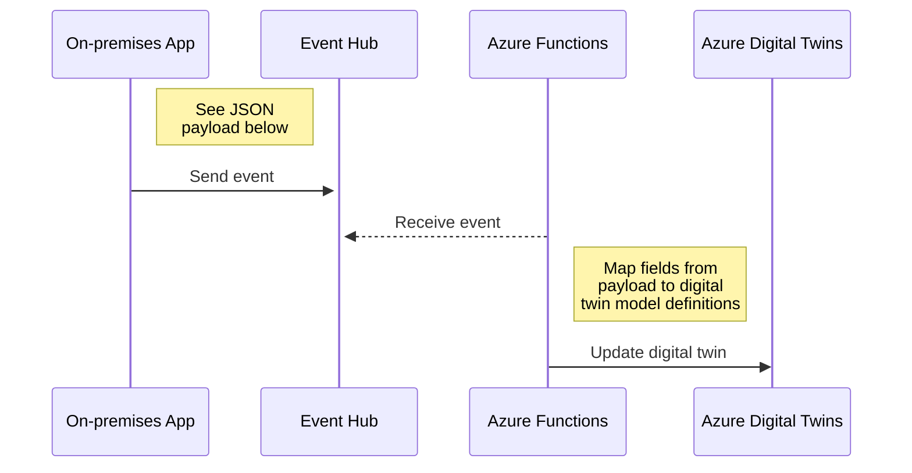

# Azure Digital Twins demos

Azure Digital Twins demos

## Updates From Event Hub to Azure Digital Twins



### Using static structure

You can find example models in [car-demo](./models/car-demo) folder for `Car` and `Tyre`.

Example payloads if `ProcessingLogic` is set to `ByID`:

```json
{
  "_id": "Matiz",
  "carStatus": "Moving",
  "speed": 121.8
}
```

```json
{
  "_id": "LeftFront",
  "tyreStatus": "OK",
  "pressure": 2.3
}
```

Note: `_id` is identifier of the digital twin.

These payloads are picked by [AzureDigitalTwinsUpdaterFunc](./src/AzureDigitalTwinsUpdaterFunc) which
then processes mapping of incoming data to the target digital twin.

**Note**: Only `Property` types in the model are updated by the updater.

You can send events to Event Hub using [examples.ps1](./examples.ps1) script.

Example search in Azure Digital Twin Explorer to find all these twins:

```sql
SELECT * FROM digitaltwins WHERE STARTSWITH($metadata.$model, 'dtmi:com:janneexample')
```


### Using dynamic structure

You can find example models in [ISA95](https://github.com/digitaltwinconsortium/UA-CloudTwin/tree/main/Applications/ISA95) folder for `OPCUANodeset` and `OPCUANodeInteger`.
Using these models, you can create dynamic structure to represent values in child twins.

Example payloads if `ProcessingLogic` is set to `ByChild`:

```json
{
  "_id": "myeq123",
  "MyValue1": 8,
  "MyValue2": 12
}
```

```sql
SELECT T, CT FROM digitaltwins T JOIN CT RELATED T.contains WHERE T.$dtId = '50001'
```


### Deployment to Azure

Key deployment steps:

- Create Azure Digital Twin
  - Load example models into it from [car-demo](./models/car-demo)
- Create Event Hub namespace
  - Create `adt` Event Hub and copy connection string
- Create Azure Functions App
  - App Settings to Function App
      - `ADTOptions__ADTInstanceUrl` e.g., `https://<your-adt-instance>.api.neu.digitaltwins.azure.net/`
      - `ADTOptions__IDFieldName` e.g., `_id`
      - `ADTOptions__ProcessingLogic` either `ByID` or `ByChild`
        - `ByID` searches by digital twin id `$dtId`. Found twin is directly updated.
        - `ByChild` searches parent digital twin by `equipmentID`, finds all children twins by `ID` and updates child twins `OPCUANodeValue` property.
      - `EventHubName` e.g., `adt`
      - `EventHubConnectionString` e.g., `Endpoint=sb://<your-eventhub-instance>.servicebus.windows.net/;SharedAccessKeyName=...` 
  - Enable System Assigned Managed Identity
- Add Role Assignment: `Azure Digital Twins Data Owner` role to the managed identity of Azure Functions App
- Deploy using Visual Studio to Azure Functions app
  - Visual Studio will validate that settings in Azure Function App are correct e.g., 
    `FUNCTIONS_WORKER_RUNTIME=dotnet-isolated` and `FUNCTIONS_EXTENSION_VERSION=~4`

## Links

[Azure Digital Twins getting started samples](https://github.com/Azure-Samples/azure-digital-twins-getting-started)

[Azure Digital Twins APIs and SDKs](https://learn.microsoft.com/en-us/azure/digital-twins/concepts-apis-sdks)

[Learn about twin models and how to define them in Azure Digital Twins](https://learn.microsoft.com/en-us/azure/digital-twins/concepts-models)
