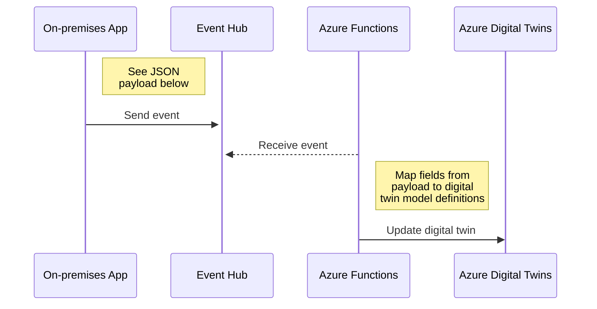

# Azure Digital Twins demos

Azure Digital Twins demos

## Updates From Event Hub to Azure Digital Twins

You can find example models in [car-demo](./models/car-demo) folder for `Car` and `Tyre`.



Example payloads:

```json
{
  "_id": "Matiz",
  "_model": "dtmi:com:janneexample:car;1",
  "carStatus": "Stopped",
  "speed": 121.8
}
```

```json
{
  "_id": "LeftFront",
  "_model": "dtmi:com:janneexample:tyre;1",
  "tyreStatus": "OK",
  "pressure": 2.3
}
```

Notice two special fields in the payload:

- `_id` is identifier of the digital twin
- `_model` is model name of the payload

These are picked by [AzureDigitalTwinsUpdaterFunc](./src/AzureDigitalTwinsUpdaterFunc) which
then processes mapping of incoming data to the target digital twin.

**Note**: Only `Property` types in the model are updated by the updater.

You can send events to Event Hub using [examples.ps1](./examples.ps1) script.

Example search in Azure Digital Twin Explorer to find all these twins:

```sql
SELECT * FROM digitaltwins WHERE STARTSWITH($metadata.$model, 'dtmi:com:janneexample')
```


## Links

[Learn about twin models and how to define them in Azure Digital Twins](https://learn.microsoft.com/en-us/azure/digital-twins/concepts-models)
